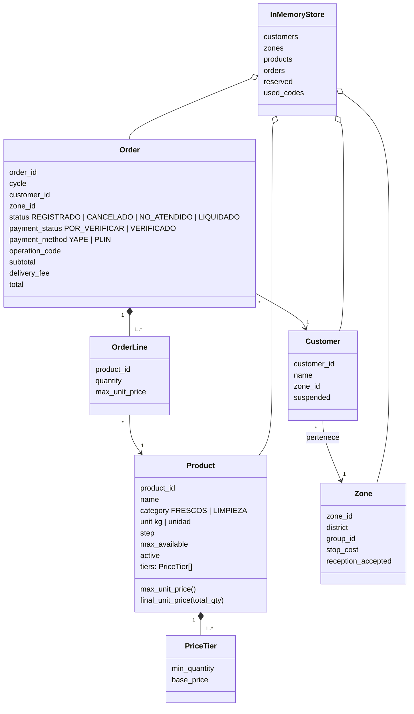
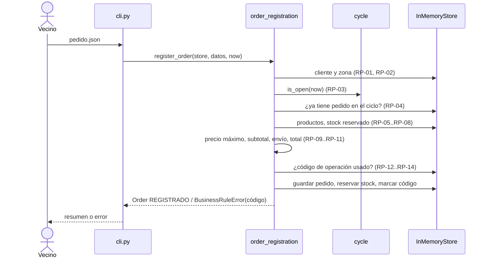
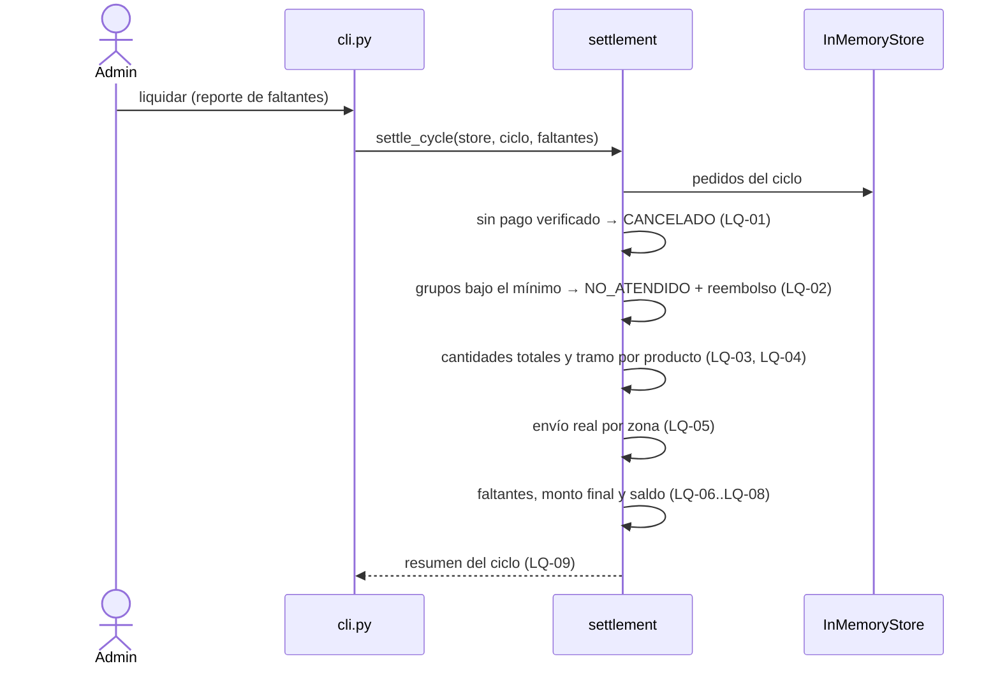
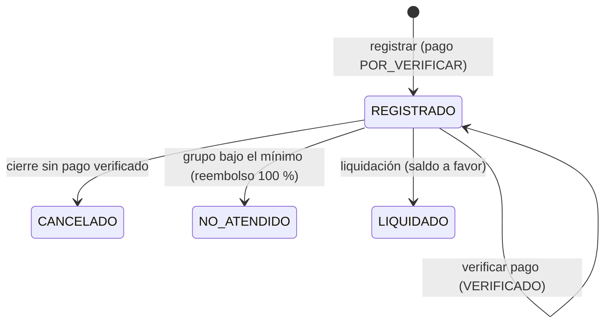

# Diseño · iteración 2

GitHub dibuja estos diagramas directamente (Mermaid).

## Modelo de dominio

```mermaid
classDiagram
    class Product {
        product_id
        name
        category  FRESCOS | LIMPIEZA
        unit  kg | unidad
        step
        max_available
        active
        tiers: PriceTier[]
        max_unit_price()
        final_unit_price(total_qty)
    }
    class PriceTier {
        min_quantity
        base_price
    }
    class Zone {
        zone_id
        district
        group_id
        stop_cost
        reception_accepted
    }
    class Customer {
        customer_id
        name
        zone_id
        suspended
    }
    class Order {
        order_id
        cycle
        customer_id
        zone_id
        status  REGISTRADO | CANCELADO | NO_ATENDIDO | LIQUIDADO
        payment_status  POR_VERIFICAR | VERIFICADO
        payment_method  YAPE | PLIN
        operation_code
        subtotal
        delivery_fee
        total
    }
    class OrderLine {
        product_id
        quantity
        max_unit_price
    }
    class InMemoryStore {
        customers
        zones
        products
        orders
        reserved
        used_codes
    }
    Product "1" *-- "1..*" PriceTier
    Customer "*" --> "1" Zone : pertenece
    Order "*" --> "1" Customer
    Order "1" *-- "1..*" OrderLine
    OrderLine "*" --> "1" Product
    InMemoryStore o-- Customer
    InMemoryStore o-- Zone
    InMemoryStore o-- Product
    InMemoryStore o-- Order
```

## Registrar pedido (secuencia)

```mermaid
sequenceDiagram
    actor Vecino
    participant CLI as cli.py
    participant REG as order_registration
    participant CYC as cycle
    participant ST as InMemoryStore
    Vecino->>CLI: pedido.json
    CLI->>REG: register_order(store, datos, now)
    REG->>ST: cliente y zona (RP-01, RP-02)
    REG->>CYC: is_open(now) (RP-03)
    REG->>ST: ¿ya tiene pedido en el ciclo? (RP-04)
    REG->>ST: productos, stock reservado (RP-05..RP-08)
    REG->>REG: precio máximo, subtotal, envío, total (RP-09..RP-11)
    REG->>ST: ¿código de operación usado? (RP-12..RP-14)
    REG->>ST: guardar pedido, reservar stock, marcar código
    REG-->>CLI: Order REGISTRADO / BusinessRuleError(código)
    CLI-->>Vecino: resumen o error
```

## Liquidar ciclo (secuencia)

```mermaid
sequenceDiagram
    actor Admin
    participant CLI as cli.py
    participant LQ as settlement
    participant ST as InMemoryStore
    Admin->>CLI: liquidar (reporte de faltantes)
    CLI->>LQ: settle_cycle(store, ciclo, faltantes)
    LQ->>ST: pedidos del ciclo
    LQ->>LQ: sin pago verificado → CANCELADO (LQ-01)
    LQ->>LQ: grupos bajo el mínimo → NO_ATENDIDO + reembolso (LQ-02)
    LQ->>LQ: cantidades totales y tramo por producto (LQ-03, LQ-04)
    LQ->>LQ: envío real por zona (LQ-05)
    LQ->>LQ: faltantes, monto final y saldo (LQ-06..LQ-08)
    LQ-->>CLI: resumen del ciclo (LQ-09)
```

## Estados del pedido

```mermaid
stateDiagram-v2
    [*] --> REGISTRADO : registrar (pago POR_VERIFICAR)
    REGISTRADO --> REGISTRADO : verificar pago (VERIFICADO)
    REGISTRADO --> CANCELADO : cierre sin pago verificado
    REGISTRADO --> NO_ATENDIDO : grupo bajo el mínimo (reembolso 100 %)
    REGISTRADO --> LIQUIDADO : liquidación (saldo a favor)
```
